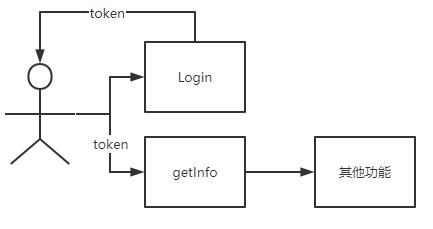
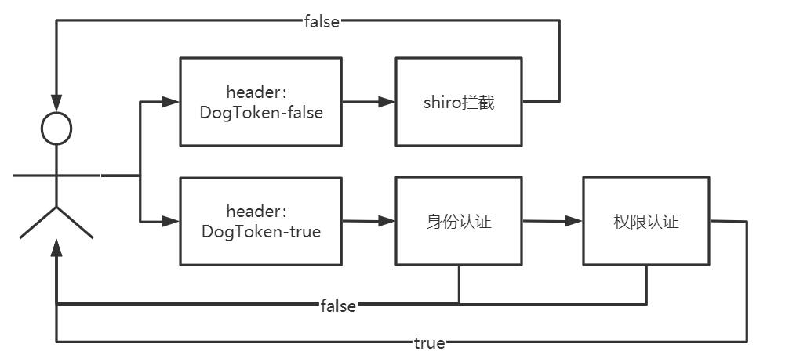
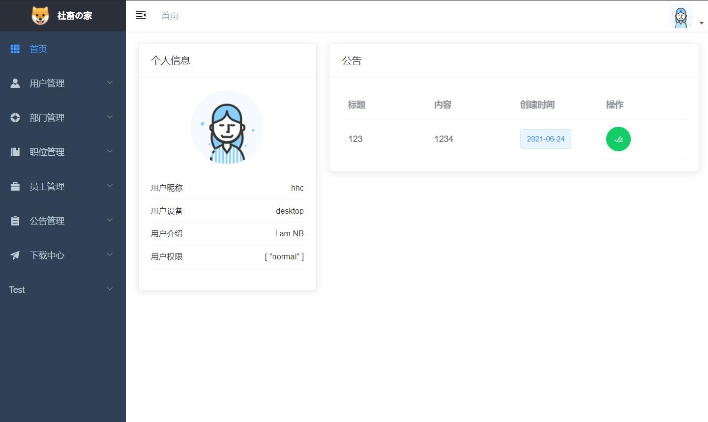
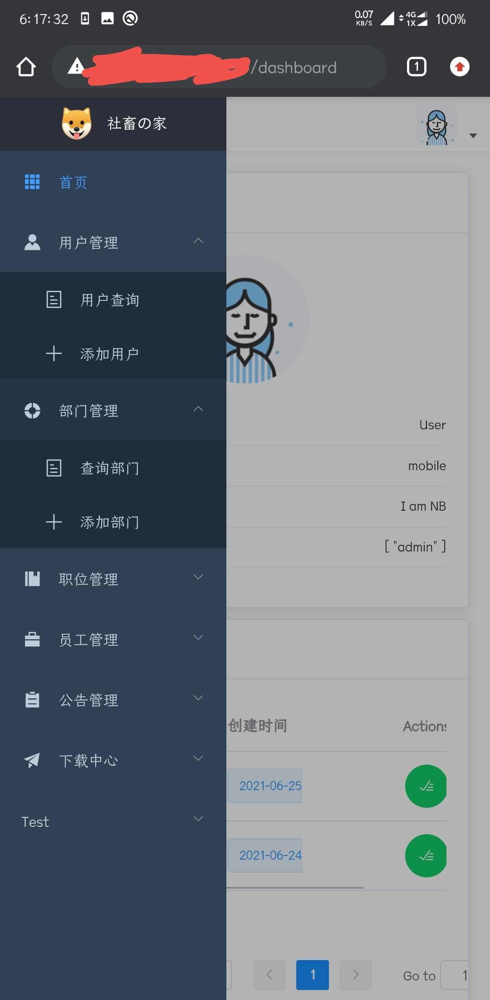

# EmployeeHome
CSI员工之家与人事管理系统其实有很多共同之处是办公信息自动化建设中最常见的项目，几乎每个OA系统中都需要。
## 一、技术架构

## 二、概要设计
### 1、基础模块
- 账密登录
- 刷脸登录
- 首页
- 用户管理
- 部门管理
- 职位管理
- 员工管理
- 公告管理
- 下载中心
### 2、其他功能
- 前端（二次开发vue-element-template）
    - 用户鉴权
        - 页面权限
        - 组件权限
    - 支持Mock数据
    - 动态表格
- 后端（SpringBoot）
    - JWT+Shiro安全框架
    - 模糊搜索
    - MVC结构
    - JPA增删查改
    - 支持文件服务器
### 3、基本目录结构
```
employee-home  # 项目根目录
├─ csi.sql  # 数据库结构
├─ backend  # 后端部分
│    ├─ pom.xml  maven依赖配置
│    └─ src
│           ├─ main
│           │    ├─ java
│           │    │    └─ com-csi-emphome-demo
│           │    │           ├─ DemoApplication.java  # 程序入口
│           │    │           ├─ domain  # ORM映射
│           │    │           ├─ repository  # 继承JPA接口
│           │    │           ├─ rest  # 控制层
│           │    │           ├─ service  # 服务层
│           │    │           └─ utils  # 工具程序
│           │    │                  ├─ config  # 文件配置
│           │    │                  ├─ jwt  # JWT相关
│           │    │                  ├─ shiro  # Shiro配置
│           │    │                  └─ other  # 其他
│           │    └─ resources  # 配置及静态文件
│           └─ test  # 单元测试
└─ frontend
       ├─ .env.development  # 开发环境配置
       ├─ .env.production  # 生成环境配置
       ├─ mock  # mock相关
       ├─ public  # 公用资源
       ├─ src
       │    ├─ App.vue  # 入口
       │    ├─ main.js  # 入口
       │    ├─ api  # api统一封装
       │    ├─ assets  # 统一资源
       │    ├─ components  # 统一资源
       │    ├─ icons  # 统一资源
       │    ├─ layout  # 整体布局
       │    ├─ permission.js  # 权限相关
       │    ├─ router  # 路由
       │    ├─ settings.js  # 一些配置
       │    ├─ store  # VUEX
       │    ├─ styles  # 统一styles
       │    ├─ utils  # 工具程序
       │    └─ views  # 业务布局
       └─ vue.config.js  # 项目配置
```
## 三、详细设计
### 1、登录逻辑
- 用户输入账号密码后，前端会完成密码的初步筛查
- 在后端与数据库进行比对，如果密码或账号错误，前端均会接收到错误码为`20001`的错误提醒
- 登录成功后，用户即可访问页面
### 2、用户鉴权设计
- 基于token的用户身份判断
    - 用户登陆`Login`时，后端会将用户名与密码（刷脸则首先需要人脸识别与数据库对比）经过jwt加密生成token
    - 前端每次进行操作均需`getInfo`将token进行校验比对
    - 前端会保存用户的token及权限，通过`<v-if>`实现组件控制，通过`Router/hidden`实现页面控制，从而进行页面或组件级的限制

### 3、API访问限制设计
- 基于Shrio的API访问限制
    - 后端会通过Shiro拦截对API访问，除了设定绕过的请求，其余Request需在Header中携带token进行访问
    - 后端之后会依次进行身份认证和权限认证
    - 后端每个鉴权步骤出现异常均会向前端返回鉴别失败

### 3、业务CRUD设计
略
### 4、文件服务器设计
- 在`application.properties`配置文件存储路径及文件大小限制
- 在`config`中配置文件服务器的相关配置以及文件操作类
- 文件上传：前端使用`<el-upload>`完成对文件的上传，后端接收成功后将文件保存在相应目录，同时将保存信息写入数据库
- 文件下载：后端将文件存储目录传回至前端，前端使用`:href`完成对文件的下载。
## 四、项目演示
- 桌面端

- 移动端

